# nix-home

This repository is a declarative macOS configuration using `nix`, `nix-darwin`,
and `home-manager`.

- [nix-home](#nix-home)
  - [Architecture](#architecture)
  - [Installation](#installation)
    - [1. Install Dependencies](#1-install-dependencies)
      - [1.1. Install Nix](#11-install-nix)
        - [Alternative installation method](#alternative-installation-method)
      - [1.2. Install Homebrew](#12-install-homebrew)
    - [2. Clone Repository](#2-clone-repository)
    - [3. Build Nix stores](#3-build-nix-stores)
      - [3.1. Backup the existing `nix.conf` file](#31-backup-the-existing-nixconf-file)
    - [4. Switch to the built Nix stores](#4-switch-to-the-built-nix-stores)
    - [5. Import GPG Keys](#5-import-gpg-keys)
    - [6. Decrypt secrets](#6-decrypt-secrets)
    - [7. Resync encrypted secrets](#7-resync-encrypted-secrets)
    - [8. Set `nix-home` remote URL to use SSH](#8-set-nix-home-remote-url-to-use-ssh)
    - [9. Clone URL shortener repositories](#9-clone-url-shortener-repositories)
  - [Updates](#updates)
    - [1. Find the latest stable version of Nix](#1-find-the-latest-stable-version-of-nix)
    - [2. Update flake.lock file](#2-update-flakelock-file)
  - [Additional Scripts](#additional-scripts)
    - [Fetch packages from GitHub](#fetch-packages-from-github)
  - [References](#references)

## Architecture

This nix-home configuration follows a modular architecture that separates concerns between system-level configuration (nix-darwin), package management (Homebrew), and user-level configuration (home-manager).

```mermaid
graph LR
    %% External Inputs
    nixpkgs[📦 nixpkgs<br/>24.11-darwin]
    darwin_input[🔧 nix-darwin<br/>24.11]
    hm_input[🏠 home-manager<br/>release-24.11]
    
    %% Core Configuration
    flake[⚡ flake.nix<br/>Entry Point]
    
    %% nix-darwin Configuration
    config[🍎 configuration.nix<br/>System Settings]
    homebrew[🍺 homebrew.nix<br/>Package Management]
    
    %% Home Manager Configuration
    home_default[🏠 home/default.nix<br/>Home Manager Entry]
    packages[📦 home/packages.nix<br/>User Packages]
    git_config[🔀 home/git.nix<br/>Git Configuration]
    shells[🐚 home/shells.nix<br/>Shell Configuration]
    assets[📁 home/assets.nix<br/>Dotfiles & Assets]
    
    %% Darwin System Output
    darwin_system[🚀 Darwin System<br/>zain Configuration]
    
    %% Relationships
    nixpkgs --> flake
    darwin_input --> flake
    hm_input --> flake
    
    flake --> config
    flake --> homebrew
    flake --> home_default
    
    home_default --> packages
    home_default --> git_config
    home_default --> shells
    home_default --> assets
    
    config --> darwin_system
    homebrew --> darwin_system
    home_default --> darwin_system
    
    %% Styling with high contrast colors
    classDef input fill:#e3f2fd,stroke:#1976d2,stroke-width:2px,color:#000000
    classDef core fill:#f3e5f5,stroke:#7b1fa2,stroke-width:2px,color:#000000
    classDef darwin fill:#fff3e0,stroke:#f57c00,stroke-width:2px,color:#000000
    classDef home fill:#e8f5e8,stroke:#388e3c,stroke-width:2px,color:#000000
    classDef output fill:#fce4ec,stroke:#d81b60,stroke-width:3px,color:#000000
    
    class nixpkgs,darwin_input,hm_input input
    class flake core
    class config,homebrew darwin
    class home_default,packages,git_config,shells,assets home
    class darwin_system output
```



### Key Components

- **🍎 System Configuration**: macOS system defaults, Nix daemon settings, and user management
- **🍺 Homebrew Integration**: GUI applications, CLI tools, and development environments not available in nixpkgs
- **🏠 Home Manager**: User-specific configurations including packages, shell setup, Git configuration, and dotfiles
- **📁 Modular Structure**: Each aspect of the configuration is separated into focused modules for maintainability

## Installation

### 1. Install Dependencies

#### 1.1. Install Nix

The recommended installation method is to Nix using Determinate Systems'
installer that is downloadable here <https://docs.determinate.systems/>.

##### Alternative installation method

You can also install Nix using
[nix-installer](https://zero-to-nix.com/concepts/nix-installer). Read more about
it in the
[Get Nix running on your system](https://zero-to-nix.com/start/install) guide.

```shell
curl --proto '=https' --tlsv1.2 -sSf -L https://install.determinate.systems/nix | sh -s -- install
```

> [!warning]
>
> This way of installing Nix may not work if you have
> [`nix.enable = false` in your `configuration.nix` file](https://github.com/zainfathoni/nix-home/blob/b3ac0b52c284e5e92aa235d9c43ff82ac1716c3e/configuration.nix#L54).
> If you have that, you can either remove that line or use the recommended
> installation method above.

#### 1.2. Install Homebrew

We need to [install Homebrew manually](https://brew.sh) because
[`nix-darwin` won't handle Homebrew installation itself](https://daiderd.com/nix-darwin/manual/index.html#opt-homebrew.enable).

```shell
/bin/bash -c "$(curl -fsSL https://raw.githubusercontent.com/Homebrew/install/HEAD/install.sh)"
```

> **Note**: Restart the machine if you
> [experience issues with downloading Homebrew](https://github.com/orgs/Homebrew/discussions/3343#discussioncomment-3628470).

Once the installation is complete, follow the instructions to add Homebrew to
the `PATH` environment variable.

```shell
echo >> /Users/zain/.zprofile
echo 'eval "$(/opt/homebrew/bin/brew shellenv)"' >> /Users/zain/.zprofile
eval "$(/opt/homebrew/bin/brew shellenv)"
```

### 2. Clone Repository

Clone this repository using HTTPS (because, at this point, we can't expect the
new machine to have SSH set up).

```shell
cd ~/Code
mkdir GitHub && cd GitHub
mkdir zainfathoni && cd zainfathoni
git clone https://github.com/zainfathoni/nix-home.git
cd nix-home
```

### 3. Build Nix stores

```shell
nix build .#darwinConfigurations.zain.system
```

#### 3.1. Backup the existing `nix.conf` file

Before continuing, backup the existing `/etc/nix/nix.conf` file from the initial
Nix installation by running these commands.

```shell
cd /etc/nix
sudo mv nix.conf nix.conf.before-nix-darwin
```

### 4. Switch to the built Nix stores

Running the build result would also run the `brew bundle` command, which will
install Brew packages defined in this repository.

```shell
cd ~/Code/GitHub/zainfathoni/nix-home
./result/sw/bin/darwin-rebuild switch --flake .#zain
```

Stand by to type the password when prompted. At least these casks would require
the password:

- `docker`
- `gpg-suite-no-mail`
- `logi-options+`
- `karabiner-elements`
- `nordvpn`
- `zoom`

And by the end of the Homebrew installation, the `nix-darwin` will ask for the
password to apply all the changes.

### 5. Import GPG Keys

Import GPG Keys from my password manager.

1. Open the GPG Keychain application.
2. Copy the private key block to the clipboard.
3. The GPG Keychain will detect the private keys automatically.

### 6. Decrypt secrets

Once `yadm` is installed using the command above, we can use `yadm` to decrypt
the secrets.

```shell
yadm clone https://github.com/zainfathoni/yadm-home.git
# if necessary, run this command to restore all checked out YADM files after cloning
yadm reset --hard HEAD
yadm decrypt
# enter the passphrase (if prompted)
```

### 7. Resync encrypted secrets

To resync your encrypted files with yadm after making changes:

```shell
yadm encrypt
yadm commit -am "update encrypted secrets"
yadm push
```

The steps are:
1. **Encrypt** to create/update the encrypted archive
2. **Commit** with `-am` to stage and commit all modified files
3. **Push** to sync with your remote yadm repository

### 8. Set `nix-home` remote URL to use SSH

Now that we have the SSH keys set up, we can change the remote URL to use SSH.

```shell
cd ~/Code/GitHub/zainfathoni/nix-home
git remote set-url origin git@github.com:zainfathoni/nix-home.git
```

### 9. Clone URL shortener repositories

```shell
volta install node
volta install yarn@1
volta install pnpm
~/scripts/clone.sh
```

## Updates

Here's how to update the Nix registry to the latest versions.

### 1. Find the latest stable version of Nix

Visit [Nix official website](https://nixos.org/) and find the latest stable
version on the home page. Once you find the latest version, update all versions
in [flake.nix](./flake.nix) and [default.nix](./home/default.nix) files
accordingly.

### 2. Update flake.lock file

If you change nix dependencies, it's better to update the `flake.lock` file
accordingly. You can do it by using either of these commands:

```shell
$ nix flake update # run this when you're inside the root directory of this nix-home repository
```

## Additional Scripts

### Fetch packages from GitHub

Get `rev` & `sha256` values for packages fetched from GitHub.

```shell
$ nix-prefetch-git <github-repository-url>
```

## References

- [Declarative macOS Configuration Using nix-darwin And home-manager](https://xyno.space/post/nix-darwin-introduction)
